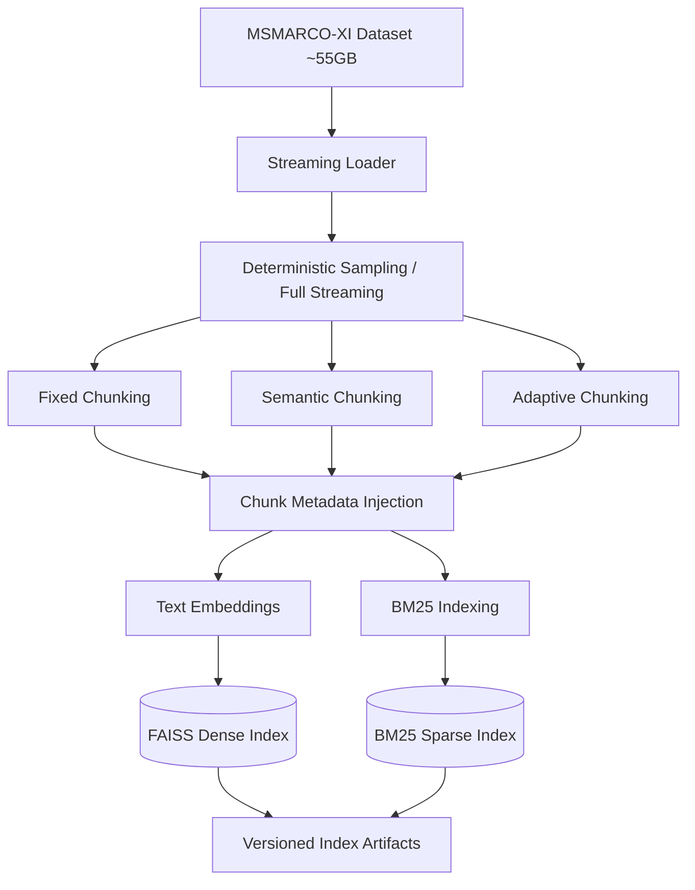

# VaaniRAG Architecture

## A. Offline Indexing Pipeline



## B. Online RAG Pipeline

```mermaid
flowchart TD
    User([User Voice/Text]) --> Frontend[Next.js Frontend]
    Frontend --> Orchestrator[FastAPI / RAG Orchestrator\nwith Retries & Timeouts]
    
    Orchestrator --> |Voice Input| STT[Sarvam STT]
    STT --> InputGuard
    Orchestrator --> |Text Input| InputGuard[Input Guardrail (Safety Check)]
    
    InputGuard --> LangHandle[Language Handling]
    LangHandle --> QueryEmbed[Query Embedding]
    
    subgraph "Retrieval Engine"
        QueryEmbed --> FAISS[(FAISS Dense Index)]
        QueryEmbed --> BM25[(BM25 Sparse Index)]
        FAISS --> RRF[Reciprocal Rank Fusion]
        BM25 --> RRF
        RRF --> Reranker[Cross-Encoder Reranker]
    end
    
    Reranker --> RetGuard[Retrieval Guardrail]
    RetGuard --> |Relevance < Threshold| Refuse1([Refused: Off-topic])
    
    RetGuard --> |PASS| LLM[Groq LLM: llama-3.1-8b-instant]
    
    LLM --> GroundGuard[Grounding Guardrail]
    GroundGuard --> |FAIL| Refuse2([Refused: Ungrounded])
    
    GroundGuard --> |PASS| Final[Answer + Sources + Latency Metrics]
    
    Final --> Frontend
    
    %% Observability Layer
    Observability[Metrics & Analytics:\nP50/P70/P100, Recall@K, MRR] -.-> Orchestrator
```
